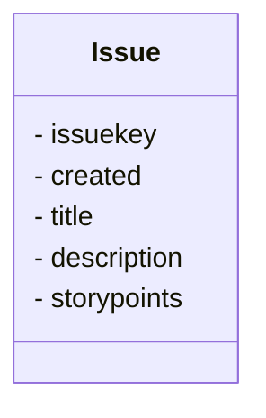

# NEODATASET

NEODATASET is a dataset containing title and description in natural language of User Stories and their Story Points extracted from GitLab.

This dataset is used in my research, [User Story Tutor](https://github.com/giseldo/userstory), and was presented in [this article](https://www.scitepress.org/PublicationsDetail.aspx?ID=PpuYOsDviJ4=&t=1). A version of the [article is also available at arxiv](https://arxiv.org/abs/2406.16259).

Another use of this dataset can be seen in [this another article at arxiv](https://arxiv.org/abs/2503.13279) from another researchers.

Some information (in brazilian portuguese) can be read at [this paper](https://periodicos.ufpe.br/revistas/index.php/RMP/article/view/265431/49351).

## Description

This dataset encompasses data from 34 software development projects, with 40.014 User Stories taken from GitLab repositories, totaling 163.897 Story Points. It is made available on GitHub, huggging face and mendeley data, so that the entire interested community can contribute, similarly to what happens with other datasets.

This dataset was mined during January 2023 and April 2023. The mining process targeted GitLab’s top open-source projects. The selected projects employ agile software development methodologies and had the size of their tasks recorded in Story Points. To mine information from GitLab, we created an extraction tool implemented in Python that connects to GitLab via API. Only Tasks with the State attribute equal to Closed and that have the weight attribute filled in were collected. The weight field is used in GitLab to record the effort in Story Points. More information about the projects included in the dataset is also available directly from GitLab. 

The projects in the dataset have different characteristics and cover different programming languages, different business domains, and different geographic locations of the team. The main entity of the dataset is the User Story (or Issue), which contains the main information. The CSV format is easier to use and contains only the attributes: issue key, created, title, description, and story points, making it more user-friendly. 

The expected contribution is that this data set can assist education and research on agile software development. Although our dataset was initially designed for Story Points and User Story estimation training and research, it also includes information relevant to other software engineering aspects. In addition to providing a possibility to reproduce findings from other studies.

## Dataset columns



- issuekey: User Story ID
- created: Date of the created of the User Story
- title: Title of User Story
- description: Description of User Story
- storypoints: Count of the user story informed by the team


## Info

You can also access this dataset in only one CSV file from [HuggingFace repository](https://huggingface.co/datasets/giseldo/neodataset). It also is available at [Mendeley Data](https://data.mendeley.com/datasets/skk2wn9j86/1). 

```Python
import pandas as pd

df = pd.read_csv("hf://datasets/giseldo/neodataset/issues.csv")
```

# Projects in dataset
```mermaid
table
  title Estatísticas descritivas dos dados do NEODATASET
  header ID, Projeto, Total Tarefas, Total SP, Média, STD, Mín, 25%, 50%, 75%, Max
  10152778, Minds, 521, 1594, 3.1, 4.2, 0, 1, 2, 3, 80
  10171280, Minds Mobile, 2796, 7213, 2.6, 2.7, 0, 1, 2, 3, 50
  12894267, MLReef, 285, 1419, 5.0, 5.0, 0, 2, 4, 6, 40
  3828396, GitLab Chart, 15, 31, 2.1, 1.2, 1, 1, 2, 2, 5
  278964, GitLab, 19548, 41270, 2.1, 1.8, 0, 1, 2, 3, 160
  6206924, Tildes, 42, 91, 2.2, 1.0, 1, 1.25, 2, 3, 4
  12584701, StackGres, 171, 1106, 6.5, 7.4, 1, 2, 4, 8, 48
  7764, Gitlab.com, 355, 970, 2.7, 7.2, 0, 1, 2, 3, 128
  12450835, Duplicity, 424, 5798, 13.7, 22.1, 4, 6, 6, 12, 260
  28847821, Buyer Experience, 1004, 2665, 2.7, 2.0, 0, 1, 2, 4, 14
  10174980, Veloren, 178, 502, 2.8, 2.8, 1, 1, 2, 3, 15
  250833, Gitlab Runner, 13, 35, 2.7, 2.2, 1, 1, 2, 3, 9
  23285197, Subway, 284, 507, 1.8, 1.5, 0, 1, 1, 2, 13
  1304532, Gitlab GL Infra Reliability, 1724, 4520, 2.6, 2.5, 0, 1, 2, 3, 21
  14052249, Mythictable, 167, 509, 3.0, 2.9, 1, 2, 2, 3, 20
  28419588, Lazarus, 144, 17800, 123.6, 48.7, 100, 100, 100, 100, 300
  4456656, Pajamas Design System, 344, 684, 2.0, 1.6, 0, 1, 1, 3, 13
  3836952, Tezos, 103, 2771, 26.9, 38.6, 0, 2.5, 5, 32, 100
  7603319, Meltano, 237, 1107, 4.7, 5.3, 0, 1, 4, 8, 40
  7776928, Triage ops, 216, 442, 2.0, 1.2, 1, 1, 2, 2, 10
  2670515, Customers gitlab com, 1574, 3137, 2.0, 1.2, 0, 1, 2, 2, 15
  21149814, Opengeoweb, 1942, 5668, 2.9, 1.5, 1, 2, 3, 3, 20
  15502567, Kicad, 3284, 34692, 10.6, 14.2, 4, 6, 6, 10, 268
  1714548, Petals Vockpit, 154, 400, 2.6, 1.5, 1, 1, 2, 3, 8
  7128869, Nlx, 327, 1355, 4.1, 3.6, 0, 2, 3, 5, 21
  10171263, Minds Backend Engine, 982, 3742, 3.8, 3.7, 0, 2, 3, 5, 32
  14976868, Database Lab Engine, 113, 721, 6.4, 7.6, 1, 2, 4, 8, 42
  2009901, Gitaly, 171, 401, 2.3, 1.5, 1, 1, 2, 3, 13
  28644964, FPC Source, 102, 14200, 139.2, 63.2, 100, 100, 100, 200, 300
  7071551, Gitlab UI, 310, 600, 1.9, 2.0, 0, 1, 2, 2, 32
  734943, Gitlab Pages, 121, 265, 2.2, 2.6, 1, 1, 1, 3, 20
  10171270, Minds Frontend, 1845, 5695, 3.1, 3.2, 0, 1, 2, 4, 40
  5261717, Gitlab vscode extension, 106, 185, 1.7, 0.7, 1, 1, 2, 2, 4
  19921167, Glaxnimate, 420, 1802, 4.3, 4.0, 1, 2, 3, 5, 40
  , Total, 40022, 163897, , , , , , ,
```

## How to cite

Neo, G. S., Moura, J., Almeida, H., Neo, A. and Freitas Júnior, O. (2024). User Story Tutor (UST) to Support Agile Software Developers. In Proceedings of the 16th International Conference on Computer Supported Education - Volume 2: CSEDU; ISBN 978-989-758-697-2; ISSN 2184-5026, SciTePress, pages 51-62. DOI: 10.5220/0012619200003693

```bibtex
@conference{csedu24,
author={Giseldo S. {Neo} and José Moura and Hyggo Almeida and Alana Neo and Olival {Freitas Júnior}},
title={User Story Tutor (UST) to Support Agile Software Developers},
booktitle={Proceedings of the 16th International Conference on Computer Supported Education - Volume 2: CSEDU},
year={2024},
pages={51-62},
publisher={SciTePress},
organization={INSTICC},
doi={10.5220/0012619200003693},
isbn={978-989-758-697-2},
issn={2184-5026},
}
```

## Contact Autor

Giseldo S. Neo at giseldo@gmail.com. More about-me in [ResearchGate](https://www.researchgate.net/profile/Giseldo-Neo) or in my [personal site](http://giseldo.github.io).

[⭐ If you like or use it, give it a star.](https://github.com/giseldo/neodataset/stargazers)

## Star History

[](https://www.star-history.com/#giseldo/neodataset&Date)
