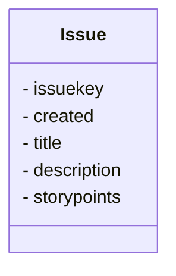

# Neo Dataset
Neo Dataset is a dataset containing projects with User Stories and Story Points extracted from GitLab.

You can acess also this dataset in [huggingface](https://huggingface.co/datasets/giseldo/neodataset) and in [Mendeley Data](https://data.mendeley.com/datasets/skk2wn9j86/1)

- [Original article](https://www.scitepress.org/PublicationsDetail.aspx?ID=PpuYOsDviJ4=&t=1)

## Autor
Giseldo da Silva Neo (giseldo@gmail.com)

## How to cite

Neo, G. S., Moura, J., Almeida, H., Neo, A. and Freitas Júnior, O. (2024). User Story Tutor (UST) to Support Agile Software Developers. In Proceedings of the 16th International Conference on Computer Supported Education - Volume 2: CSEDU; ISBN 978-989-758-697-2; ISSN 2184-5026, SciTePress, pages 51-62. DOI: 10.5220/0012619200003693

@conference{csedu24,
author={Giseldo S. {Neo} and José Moura and Hyggo Almeida and Alana Neo and Olival {Freitas Júnior}},
title={User Story Tutor (UST) to Support Agile Software Developers},
booktitle={Proceedings of the 16th International Conference on Computer Supported Education - Volume 2: CSEDU},
year={2024},
pages={51-62},
publisher={SciTePress},
organization={INSTICC},
doi={10.5220/0012619200003693},
isbn={978-989-758-697-2},
issn={2184-5026},
}

## Description
We have made a new dataset (aka Neo Dataset) available together with User Story Tutor, a software to help User Story writing. This dataset encompasses data from 34 software development projects, with 40.014 User Stories taken from GitLab repositories, totaling 163.897 Story Points. It is made available on GitHub 6 so that the entire interested community can contribute, similarly to what happens with other datasets.

This dataset was mined during January 2023 and April 2023. The mining process targeted GitLab’s top open-source projects. The selected projects employ agile software development methodologies and had the size of their tasks recorded in Story Points. To mine information from GitLab, we created an ex traction tool implemented in Python that connects to GitLab via API Only Tasks with the State attribute equal to Closed and that have the weight attribute filled in were col- lected. The weight field is used in GitLab to record the effort in Story Points. More information about the projects included in the dataset is also available directly from GitLab. 

The projects in the dataset have different characteristics and cover different programming languages, different business domains, and different geographic locations of the team. The main entity of the dataset is the User Story (or Issue), which contains the main information. The dataset has more than 70 attributes and is stored in JSON and CSV format, given the simplicity of dealing with both formats. 

The expected contribution is that this data set can assist education and research on agile software development. Although our dataset was initially designed for Story Points and User Story estimation training and research, it also includes information relevant to other software engineering aspects. In addition to providing a possibility to reproduce findings from other studies.

## Dataset columns

- issuekey: User Story ID
- created: Date of the created of the User Story
- title: Title of User Story
- description: Description of User Story
- storypoints: Count of the user story informed by the team

