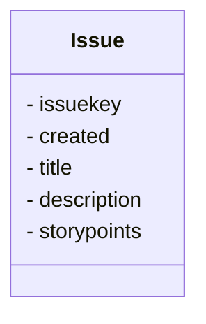

# NEODATASET

NEODATASET é um conjunto de dados (dataset) contendo título e descrição em linguagem natural de Histórias de Usuário (User Stories) e seus Pontos de História (Story Points) extraídos do GitLab.

Este conjunto de dados é usado na minha pesquisa, [User Story Tutor](https://github.com/giseldo/userstory), e foi apresentado [neste artigo](https://www.scitepress.org/PublicationsDetail.aspx?ID=PpuYOsDviJ4=&t=1). Uma versão do [artigo também está disponível no arxiv](https://arxiv.org/abs/2406.16259).

Outro uso deste conjunto de dados pode ser visto [neste outro artigo no arxiv](https://arxiv.org/abs/2503.13279) de outros pesquisadores.

## Descrição

Este conjunto de dados abrange dados de 34 projetos de desenvolvimento de software, com 40.014 Histórias de Usuário retiradas de repositórios GitLab, totalizando 163.897 Pontos de História. Ele é disponibilizado no GitHub, Hugging Face e Mendeley Data, para que toda a comunidade interessada possa contribuir, de forma semelhante ao que acontece com outros conjuntos de dados.

Este conjunto de dados foi minerado entre janeiro de 2023 e abril de 2023. O processo de mineração teve como alvo os principais projetos de código aberto (open-source) do GitLab. Os projetos selecionados empregam metodologias ágeis de desenvolvimento de software e tiveram o tamanho de suas tarefas registrado em Pontos de História. Para minerar informações do GitLab, criamos uma ferramenta de extração implementada em Python que se conecta ao GitLab via API. Apenas Tarefas (Tasks) com o atributo Estado (State) igual a Fechado (Closed) e que tinham o atributo peso (weight) preenchido foram coletadas. O campo peso (weight) é usado no GitLab para registrar o esforço em Pontos de História. Mais informações sobre os projetos incluídos no conjunto de dados também estão disponíveis diretamente no GitLab.

Os projetos no conjunto de dados têm características diferentes e cobrem diferentes linguagens de programação, diferentes domínios de negócio e diferentes localizações geográficas da equipe. A entidade principal do conjunto de dados é a História de Usuário (ou Issue), que contém as informações principais. O formato CSV é mais fácil de usar e contém apenas os atributos: `issue key`, `created`, `title`, `description` e `story points`, tornando-o mais amigável ao usuário (user-friendly).

A contribuição esperada é que este conjunto de dados possa auxiliar a educação e a pesquisa sobre desenvolvimento ágil de software. Embora nosso conjunto de dados tenha sido inicialmente projetado para treinamento e pesquisa em estimativa de Pontos de História e Histórias de Usuário, ele também inclui informações relevantes para outros aspectos da engenharia de software. Além de fornecer a possibilidade de reproduzir descobertas de outros estudos.

## Colunas do Conjunto de Dados



  - `issuekey`: ID da História de Usuário
  - `created`: Data de criação da História de Usuário
  - `title`: Título da História de Usuário
  - `description`: Descrição da História de Usuário
  - `storypoints`: Contagem de pontos da história de usuário informada pela equipe

## Informações

Você também pode acessar este conjunto de dados em um único arquivo CSV no [HuggingFace](https://huggingface.co/datasets/giseldo/neodataset).

```python
import pandas as pd

df = pd.read_csv("hf://datasets/giseldo/neodataset/issues.csv")

Ele também está disponível no [Mendeley Data](https://data.mendeley.com/datasets/skk2wn9j86/1).
```

## Como citar

Neo, G. S., Moura, J., Almeida, H., Neo, A. and Freitas Júnior, O. (2024). User Story Tutor (UST) to Support Agile Software Developers. In Proceedings of the 16th International Conference on Computer Supported Education - Volume 2: CSEDU; ISBN 978-989-758-697-2; ISSN 2184-5026, SciTePress, pages 51-62. DOI: 10.5220/0012619200003693

```bibtex
@conference{csedu24,
author={Giseldo S. {Neo} and José Moura and Hyggo Almeida and Alana Neo and Olival {Freitas Júnior}},
title={User Story Tutor (UST) to Support Agile Software Developers},
booktitle={Proceedings of the 16th International Conference on Computer Supported Education - Volume 2: CSEDU},
year={2024},
pages={51-62},
publisher={SciTePress},
organization={INSTICC},
doi={10.5220/0012619200003693},
isbn={978-989-758-697-2},
issn={2184-5026},
}
```

## Contato do Autor

Giseldo da Silva Neo em giseldo@gmail.com. Mais sobre mim em [ResearchGate](https://www.researchgate.net/profile/Giseldo-Neo) ou no meu [site pessoal](http://giseldo.github.io).

[⭐ Se você gostar ou usar, dê uma estrela.](https://github.com/giseldo/neodataset/stargazers)

## Star History

[](https://www.star-history.com/#giseldo/neodataset&Date)

[](https://www.star-history.com/#giseldo/neodataset&Date)
